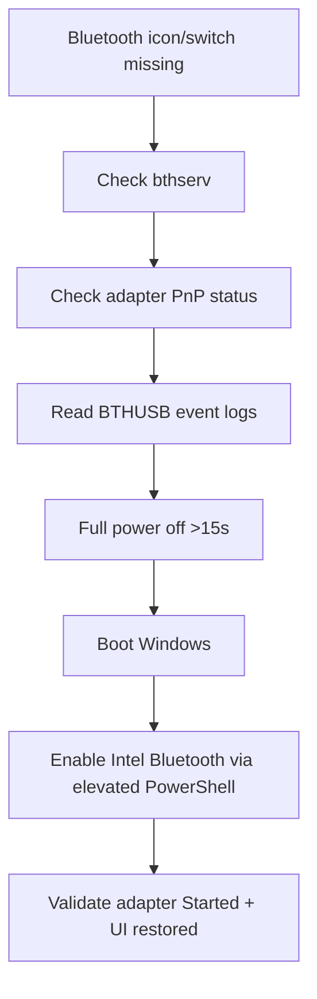

# 260709_Fix_Bluetooth

Public case study for a real Windows Bluetooth recovery session on 2026-07-09 in the Asia/Taipei timezone.

The visible symptom was simple: a Bluetooth peripheral disconnected repeatedly. The deeper failure was not the peripheral. Windows had lost a usable local Bluetooth radio because the Intel Bluetooth adapter stopped responding, logged `BTHUSB` timeout and driver-unload events, and remained unavailable until a hardware power reset and elevated adapter enable completed the recovery.

## Table of Contents

- [Project Summary](#project-summary)
- [Problem Statement](#problem-statement)
- [Environment](#environment)
- [Success Criteria](#success-criteria)
- [Key Evidence](#key-evidence)
- [Debug Timeline](#debug-timeline)
- [PowerShell Enable Steps](#powershell-enable-steps)
- [Final Fix](#final-fix)
- [Validation](#validation)
- [Why the Full Shutdown Helped](#why-the-full-shutdown-helped)
- [What Did Not Fix It](#what-did-not-fix-it)
- [Privacy Handling](#privacy-handling)
- [Repository Files](#repository-files)
- [Disclaimer](#disclaimer)

## Project Overview

This repository documents how a Windows Bluetooth outage was debugged from user-facing symptoms down to Plug and Play state, System event logs, hardware power state, and final recovery.

The final working sequence was:

```text
Full shutdown -> wait >15 seconds -> boot -> enable Intel Bluetooth -> verify Started
```

The case is useful because it separates three layers that are often mixed together during Bluetooth troubleshooting:

- the Bluetooth support service, which was running
- the local Intel Bluetooth adapter, which was not started
- paired Bluetooth devices, whose history still existed but did not explain the missing Bluetooth switch


## Features

- Evidence-first Bluetooth radio recovery on Windows
- Event Log interpretation for `BTHUSB` adapter unload failures
- Distinguishes UI/icon disappearance from adapter not started
- Elevated PowerShell enable path for Intel Wireless Bluetooth
- Full cold power-off requirement (>15 seconds) before re-enable
- Privacy-safe publication (hardware ID only; no full instance ID)

## Tech Stack

- Windows
- PowerShell (elevated)
- Intel(R) Wireless Bluetooth(R)
- Windows Event Viewer / `BTHUSB`
- Git (case-study versioning)

## Architecture



## Folder Structure

```text
260709_Fix_Bluetooth/
├── README.md
├── medium-bluetooth-debug-article.md
└── docs/
    ├── content-pack.md
    ├── debug-timeline.md
    ├── final-fix.md
    └── privacy.md
```

## Installation

This repository is a troubleshooting case study. Requirements to reproduce the recovery:

1. Windows laptop with Intel Wireless Bluetooth (`USB\VID_8087&PID_0033`)
2. Administrator PowerShell
3. Ability to fully power off (not only Restart)

## Usage

1. Confirm symptoms: Bluetooth icon/switch missing; peripherals fail
2. Collect evidence: service state, adapter status, Event Log `BTHUSB`
3. Fully power off >15 seconds, then boot
4. Enable the Intel Bluetooth adapter with elevated PowerShell
5. Validate adapter `Started` and Bluetooth UI returns


## Problem Statement

After Bluetooth became unstable, the user turned Bluetooth off on the laptop. After that, Windows no longer showed a usable Bluetooth icon or switch to turn it back on.

At first, this looked like a Windows settings or UI problem. The evidence pointed lower in the stack:

- the Bluetooth support service was running
- paired Bluetooth device history and profiles were still visible
- the main adapter, `Intel(R) Wireless Bluetooth(R)`, was not started
- Windows System logs showed the Bluetooth USB driver timing out and unloading the local adapter

The important distinction was service health versus adapter runtime state. `bthserv` could be healthy while the local Bluetooth radio was still unavailable.

## Environment

```text
OS family: Windows
Bluetooth adapter: Intel(R) Wireless Bluetooth(R)
Adapter hardware ID prefix: USB\VID_8087&PID_0033
Debug date: 2026-07-09
Timezone: Asia/Taipei
```

The full device instance ID is intentionally not published. Public examples use the hardware vendor/product prefix only:

```text
USB\VID_8087&PID_0033\...
```

## Success Criteria

The repair was considered successful only after all of these conditions were true:

1. Windows listed the Intel Bluetooth adapter.
2. The adapter state changed from non-working to `Started`.
3. The Bluetooth support service remained `Running`.
4. A final System event-log check showed no new Bluetooth `BTHUSB` errors in the last few minutes.
5. The published write-up preserved useful event-log text while removing private identifiers.

## Key Evidence

The Bluetooth support service was checked first:

```text
bthserv: Running
```

This ruled out a simple stopped-service explanation. The service layer was available, but the adapter layer was not.

The Plug and Play device query showed the main Bluetooth adapter in a failed runtime state:

```text
Device Description: Intel(R) Wireless Bluetooth(R)
Status: Stopped
Driver Name: oem239.inf
```

The decisive System event-log entries came from `BTHUSB`. First, Windows logged an adapter timeout:

```text
A command sent to the adapter has timed out. The adapter did not respond.
```

Then Windows logged that the local adapter would not be used:

```text
The local Bluetooth adapter has failed in an undetermined manner and will not be used.
The driver has been unloaded.
```

That event text explained why the Bluetooth icon and switch disappeared. Windows did not have a started local Bluetooth adapter to expose in the UI.

## Debug Timeline

1. Bluetooth became unstable and a Bluetooth peripheral disconnected repeatedly.
2. Bluetooth was turned off on the laptop.
3. Windows no longer showed a Bluetooth icon or switch that could turn Bluetooth back on.
4. The Bluetooth support service was checked and confirmed as running:

   ```text
   bthserv: Running
   ```

5. Plug and Play Bluetooth devices were queried.
6. The main adapter was visible but not working:

   ```text
   Intel(R) Wireless Bluetooth(R)
   Status: Stopped
   ```

7. Paired devices and Bluetooth profiles were still visible, but they were not the root failure.
8. An enable attempt with `pnputil` reported that the device was already enabled while the adapter still did not start:

   ```text
   Device is already enabled.
   Status: Stopped
   ```

9. A restart attempt failed:

   ```text
   Failed to restart device.
   Access is denied.
   ```

10. Restarting the Bluetooth support service did not solve the issue because the adapter itself was stuck.
11. Windows Bluetooth settings and Device Manager were opened to confirm the user-facing state and provide a manual recovery path.
12. The Windows System event log was checked.
13. `BTHUSB` showed an adapter command timeout:

    ```text
    A command sent to the adapter has timed out. The adapter did not respond.
    ```

14. `BTHUSB` then showed the local adapter failure and driver unload:

    ```text
    The local Bluetooth adapter has failed in an undetermined manner and will not be used.
    The driver has been unloaded.
    ```

15. The laptop was fully shut down and left powered off for more than 15 seconds.
16. After boot, the adapter changed from `Stopped` to `Disabled`:

    ```text
    Intel(R) Wireless Bluetooth(R)
    Status: Disabled
    ```

17. The adapter was enabled from an elevated PowerShell session.
18. Final verification showed:

    ```text
    Intel(R) Wireless Bluetooth(R): Started
    bthserv: Running
    ```

19. No new Bluetooth `BTHUSB` errors appeared in the final event-log check.

## PowerShell Enable Steps

Inspect the adapter first:

```powershell
Get-PnpDevice -Class Bluetooth |
  Where-Object { $_.InstanceId -like 'USB\VID_8087&PID_0033*' } |
  Select-Object Status, Class, FriendlyName, InstanceId
```


The successful enable step was run from an elevated PowerShell session after the full power-off cycle.

1. Open PowerShell or Windows Terminal as Administrator.
2. Use the Intel Bluetooth adapter instance ID locally, but do not publish the full value.
3. Enable the adapter with `pnputil`:

   ```powershell
   pnputil /enable-device "USB\VID_8087&PID_0033\..."
   ```

4. Recheck the adapter status and service state.

The published command intentionally truncates the full device instance ID. The safe public hardware ID prefix is:

```text
USB\VID_8087&PID_0033
```

## Final Fix

The working recovery sequence was:

1. Fully shut down the laptop.
2. Wait more than 15 seconds.
3. Power the laptop on.
4. Check the Intel Bluetooth adapter state.
5. Confirm the adapter had moved from `Stopped` to `Disabled`.
6. Enable the adapter from an elevated PowerShell session.
7. Confirm that the adapter status became `Started`.
8. Confirm that `bthserv` was still running.
9. Confirm that no new `BTHUSB` Bluetooth errors appeared in the final event-log check.

Post-boot state before enabling:

```text
Device Description: Intel(R) Wireless Bluetooth(R)
Status: Disabled
```

Command used:

```powershell
pnputil /enable-device "USB\VID_8087&PID_0033\..."
```

Verified adapter result:

```text
Device Description: Intel(R) Wireless Bluetooth(R)
Status: Started
```

Verified service result:

```text
Name: bthserv
Status: Running
StartType: Manual
```

## Result

## Validation

The validation point was not simply that the Bluetooth UI looked better. The repair was validated by system state:

```text
Intel(R) Wireless Bluetooth(R): Started
bthserv: Running
```

The final event-log check also mattered:

```text
No new Bluetooth BTHUSB errors appeared in the final event-log check.
```

This confirmed that Windows had a started adapter, the Bluetooth support service was available, and the previous timeout/unload failure was not immediately repeating.

## Why the Full Shutdown Helped

Before the full shutdown, Windows had unloaded the Bluetooth driver after the adapter stopped responding. The adapter could appear enabled in configuration while still remaining `Stopped` at runtime.

A normal settings toggle, service restart, or warm retry was not enough because the wireless module was still in a bad hardware or firmware state. A full shutdown let the module lose power long enough to reset. After boot, Windows saw the adapter as `Disabled` instead of `Stopped`. That was progress because a disabled adapter is a cleaner state that Windows can recover from by enabling it again.

The key transition was:

```text
Before full shutdown: Intel(R) Wireless Bluetooth(R) -> Stopped
After full shutdown:  Intel(R) Wireless Bluetooth(R) -> Disabled
After enable:         Intel(R) Wireless Bluetooth(R) -> Started
```

## What Did Not Fix It

These attempts were useful for diagnosis but did not complete the recovery:

- restarting the Bluetooth support service, because `bthserv` was already running
- treating the issue as a paired-device failure, because Windows itself had no started local adapter
- opening Bluetooth settings alone, because the missing switch reflected adapter state rather than a hidden UI toggle
- trying to restart the adapter with `pnputil`, which returned:

  ```text
  Failed to restart device.
  Access is denied.
  ```

- trying to enable the adapter before the hardware reset, which produced the contradiction:

  ```text
  Device is already enabled.
  Status: Stopped
  ```

If the adapter returns to `Stopped`, repeatedly logs `BTHUSB` timeout events, or disappears again after reboot, the next likely step is to reinstall or update the Intel Bluetooth driver from the laptop vendor or Intel.

## Privacy Handling

This repository keeps the diagnostic value while removing identifiers that are not needed for public sharing.

Not published:

- full Bluetooth device instance ID
- machine name
- Windows user name
- full paired-device hardware addresses
- screenshots containing private device names
- account identifiers

Published safely:

- adapter family: `Intel(R) Wireless Bluetooth(R)`
- hardware vendor/product prefix: `USB\VID_8087&PID_0033`
- service name: `bthserv`
- Windows event provider: `BTHUSB`
- generalized command examples
- debugging sequence and validation criteria

The event messages are preserved because they are the most useful part of the case study. Device identifiers are shortened where they are not necessary for understanding the repair.

## Repository Files

- [Medium article source](medium-bluetooth-debug-article.md)
- [Read the published Medium article](https://medium.com/@seek1andfind2/debugging-a-windows-intel-bluetooth-adapter-that-stopped-responding-a2532cd2f4c7)
- [Debug timeline](docs/debug-timeline.md)
- [Final fix](docs/final-fix.md)
- [Privacy notes](docs/privacy.md)
- [Content pack](docs/content-pack.md)

## Disclaimer

This is a personal troubleshooting case study, not a universal Bluetooth repair script. Bluetooth failures can come from drivers, firmware, USB power management, Windows settings, radio interference, laptop vendor utilities, or device battery issues. The useful pattern is the diagnostic method: check the service, check the adapter state, read the event logs, reset hardware power when the adapter is stuck, and verify the final state with evidence.

## Lessons Learned

- A missing Bluetooth icon is often an adapter state problem, not a Settings UI glitch
- `bthserv` running does not prove the radio is started
- `BTHUSB` unload messages are decisive evidence of adapter failure
- Full power-off duration matters more than a normal restart for some Intel adapters
- Publish only the hardware ID pattern; keep full instance IDs private

## Future Improvements

- Package the recovery into a signed `Repair-IntelBluetooth.ps1` with -WhatIf
- Add Event Log collectors that export only redacted BTHUSB entries
- Build an AI Agent triage flow: UI symptom → service → PnP → Event Log → action
